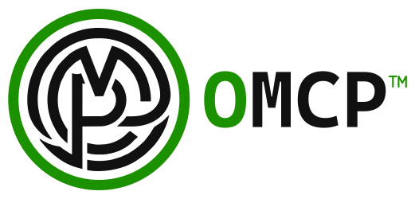

  <picture>
    <source media="(prefers-color-scheme: dark)" srcset="docs/logo/wordmark-dark.svg">
    
  </picture>

  <em>Every revolution starts with a single act of defiance.</em> 
  &#8212; Mahatma Gandhi

# Open Model Context Protocol (omcp)

**Build without permission.**

omcp is a community-driven hard fork of the Model Context Protocol specification. It exists to
keep the protocol an open, permissionless standard: developed asynchronously, reviewed
transparently on GitHub, and decided on technical merit rather than on closed-door approval.

Read [the manifesto](MANIFESTO.md).

This repo contains the:

- omcp specification
- omcp protocol schema
- omcp documentation

The schema is [defined in TypeScript](schema/2026-07-28/schema.ts) first, but
[made available as JSON Schema](schema/2026-07-28/schema.json) as well, for wider
compatibility.

## Reading the specification

The specification is published as HTML and PDF — every version, plus every proposal — at
**[enclawed.github.io/omcp](https://enclawed.github.io/omcp/)**. It is generated from this
repository on every change to `main`; nothing there is written by hand. To build it yourself, run
`npm run build:spec`. See [Published Specification](docs/community/published-specification.mdx).

## Compatibility

omcp is **drop-in compatible** with the broader Model Context Protocol ecosystem. The wire
protocol, schema field names, method names, and protocol version identifiers are unchanged, so
existing clients, servers, and SDKs interoperate without modification. The fork is in how the
specification is developed and governed, not in what goes over the wire.

## Contributing

There is no sponsor to find, no working group to join, and no approval to request. A pull
request is judged on four things: it follows good coding practices, it solves a real problem,
it clearly states the problem it solves, and it ships working unit tests — along with the data
needed to run them — that anybody can verify independently.

See [CONTRIBUTING.md](./CONTRIBUTING.md).

## Authors

The Model Context Protocol was created by David Soria Parra ([@dsp](https://github.com/dsp)) and
Justin Spahr-Summers ([@jspahrsummers](https://github.com/jspahrsummers)).

omcp is actively developed, hosted, and maintained by **Enclawed, Inc.**, to the benefit of
everyone. It is an independent fork of the original work, built together with its contributors,
and is not affiliated with or endorsed by the upstream project.

## Trademark

**Open Model Context Protocol**, **omcp**, and the omcp logo are trademarks of **Enclawed, Inc.**

The code is open; the marks are not. You may state compatibility freely ("compatible with omcp",
"an omcp server") and reproduce the logo unmodified when referring to the project. Naming your own
product, service, or fork with the marks — or implying endorsement — needs permission. See
[TRADEMARK.md](TRADEMARK.md).

## License

Code and specification contributions are licensed under the Apache License, Version 2.0.
Documentation contributions (excluding specifications) are licensed under CC-BY-4.0. Some
legacy contributions remain under the MIT License. See [LICENSE](LICENSE) for the full terms.
