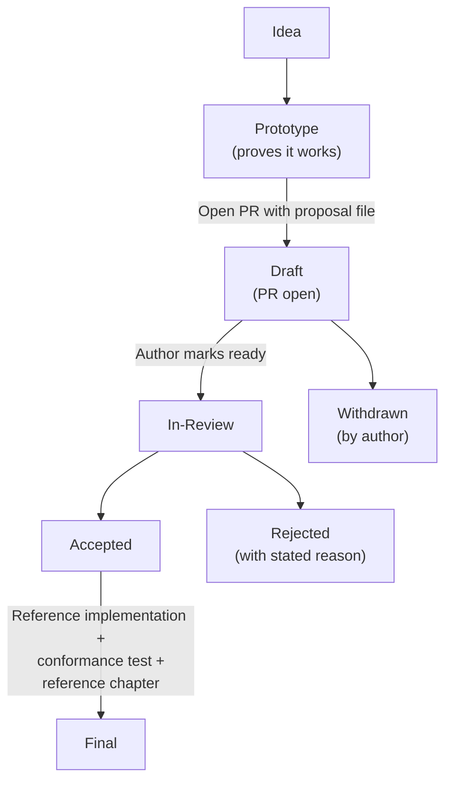

## What is a proposal?

A proposal is a design document describing a new feature for the Open Model Context Protocol, or
providing information to the community. It gives a concise technical specification of the feature
and the rationale behind it.

A proposal is **a pull request**. There is no separate track, no application, and no queue to be
admitted to. You write the document, you open the PR, and it is reviewed in the thread like any
other change.

Proposals are kept as markdown files in the
[`seps/` directory](https://github.com/enclawed/omcp/tree/main/seps) of the specification
repository, and are numbered by the pull request that introduced them. Their revision history is
the historical record of the feature. The directory retains its `seps/` name and the existing
numbering so that every proposal inherited from upstream keeps a stable, citable identity.

When drafting one, review the [design principles](/community/design-principles), which outline the
core values and tradeoffs that guide the protocol's evolution.

## When to write one

Write a proposal when the change is substantial enough to need a design document and a historical
record. A regular pull request is more appropriate for smaller changes.

**Write a proposal if your change involves:**

- **A new feature or protocol change** - Adding, modifying, or removing features in the protocol
  (new API methods, message format changes, interoperability standards)
- **A breaking change** - Any change that is not backwards-compatible
- **A complex or controversial topic** - Changes likely to have multiple valid solutions or
  generate significant debate

**Skip it for:**

- Bug fixes and typo corrections
- Documentation clarifications
- Adding examples to existing features
- Minor schema fixes that don't change behavior

If you are not sure, write the pull request anyway. A change submitted in the wrong shape gets
redirected; a change never submitted gets nothing.

## Proposal types

1. **Standards Track** - Describes a new feature or implementation for the protocol, or an
   interoperability standard supported outside the core specification.
2. **Informational** - Describes a design issue or provides guidelines to the community without
   proposing a new feature.
3. **Process** - Describes a process or proposes a change to one.
4. **Extensions Track** - Describes a protocol extension. Follows the same review process as
   Standards Track, but indicates the proposal is for an extension rather than a protocol
   addition. See [Creating Extensions](/extensions/overview#creating-extensions).

## Workflow

### Step by step

1. **Build a prototype.** Demonstrate the idea works before writing it up. What the prototype
   teaches you is the substance of the proposal. See [Prototype requirements](#prototype-requirements).

2. **Draft the proposal** as a markdown file named `0000-your-feature-title.md`, using `0000` as a
   placeholder. Follow the [format](#format) below.

3. **Open a pull request** adding your file to the `seps/` directory.

4. **Number it.** Once the PR exists, rename the file using the PR number (e.g. PR #1850 becomes
   `1850-your-feature-title.md`) and update the header.

5. **Review happens in the thread.** Openly, in writing, on technical merit. You do not need to
   find anyone to champion it, and no one needs to present it anywhere on your behalf.

6. **Resolution.** The proposal is accepted, rejected with a stated technical reason, or returned
   for revision. Whatever happens is written in the thread.

7. **Finalization.** Once accepted, add the specification changes (schema changes, specification
   text, and a changelog entry) to the same pull request, along with the reference implementation,
   any required [conformance test](#conformance-test-requirement), and the
   [reference chapter](/community/contributing#the-reference-chapter). SDK implementations are not
   required. When that work is complete, the status changes to `final` and the PR can be merged.

### Statuses

| Status       | Meaning                                                |
| ------------ | ------------------------------------------------------ |
| `draft`      | PR open, under discussion and revision                 |
| `in-review`  | Author considers it ready for a decision               |
| `accepted`   | Approved, awaiting implementation + conformance + docs |
| `rejected`   | Declined, with the technical reason in the thread      |
| `withdrawn`  | Author withdrew the proposal                           |
| `final`      | Complete with implementation, conformance, and docs    |
| `superseded` | Replaced by a newer proposal                           |

The status lives in the markdown file, which is the canonical record, and is mirrored by PR labels
so proposals can be filtered and searched. Authors maintain the status of their own proposals; no
one else's sign-off is needed to move a proposal forward for review.

## Format

Each proposal should have the following parts:

### 1. Preamble

A short descriptive title, author names/contact info, current status, type, and PR number.

### 2. Abstract

A short (~200 word) description of the technical issue being addressed.

### 3. Motivation

Why the existing protocol specification is inadequate. This is critical — a proposal without
sufficient motivation cannot be evaluated, because there is nothing to measure it against.

### 4. Specification

The technical specification describing syntax and semantics of the new feature. Must be detailed
enough for competing, interoperable implementations.

### 5. Rationale

Why particular design decisions were made, alternate designs considered, and related work. Should
address objections raised during discussion.

### 6. Backward Compatibility

Proposals introducing backward incompatibilities must describe them, their severity, and how to
deal with them. omcp stays drop-in compatible with the wider ecosystem, so a break needs an
explicit justification and a migration path.

### 7. Reference Implementation

Must be completed before the proposal reaches `final`, but need not be complete before acceptance.

### 8. Security Implications

Any security concerns should be explicitly documented.

See the [template](https://github.com/enclawed/omcp/blob/main/seps/README.md#sep-file-structure)
for the complete file structure.

## Prototype requirements

Before a proposal can be accepted, you need a prototype implementation demonstrating it.

**Acceptable prototypes:**

- A working implementation in one of the SDKs (as a branch/fork)
- A standalone proof-of-concept demonstrating the key mechanics
- Integration tests showing the proposed behavior
- A reference server or client implementing the feature

**The prototype should:**

- Demonstrate the core functionality works as described
- Show the API design is practical and ergonomic
- Reveal any edge cases or implementation challenges
- **Be runnable by reviewers** — include setup instructions and the data it needs

**Not sufficient:**

- Pseudocode alone
- A design document without code
- "Trust me, it works" — reviewers need to run it themselves

The prototype doesn't need to be production-ready. It exists to prove feasibility and surface
issues early.

## Conformance test requirement

For **Standards Track proposals** that introduce or modify observable protocol behavior, a
conformance scenario must be merged before the proposal can reach `final` status. This is the
protocol-level form of the same rule that applies to every pull request: the change ships with
tests anybody can run, and with the data needed to run them.

**What's required:**

- A conformance scenario tagged with the proposal number, targeting the draft spec-version tag
- A structured traceability file (`sep-NNNN.yaml`) mapping each MUST/MUST NOT and SHOULD/SHOULD NOT
  in the Specification section to either a check ID or a documented exclusion (with a tracking
  issue if it's a framework gap)
- The scenario passes against the reference implementation

**What's exempt:**

- Process and Informational proposals
- Standards Track proposals with no observable protocol behavior (documentation clarifications,
  non-validating schema annotations, implementation-hardening recommendations)

The test author can be anyone: the proposal author, an SDK maintainer, or any contributor.

Writing the conformance scenario while drafting is encouraged, since it often surfaces ambiguities
in normative language that are cheaper to fix early.

See [SEP-2484](/seps/2484-conformance-tests-required-for-final-seps) for the full specification
including the traceability file format.

## Documentation requirement

An accepted proposal ships its chapter for the official reference documentation, written by the
author, in the same pull request. See
[the reference chapter](/community/contributing#the-reference-chapter).

## After rejection

Rejection comes with a stated technical reason, and that reason is the thing to engage with. You
can:

1. **Address the feedback** - If specific concerns were raised, address them and resubmit
2. **Submit a competing proposal** - Sometimes a different approach works better
3. **Split it up** - A large proposal is often several smaller ones
4. **Wait** - Needs evolve; what doesn't fit today may fit later

Rejection is not permanent, and it is not personal. What it is, always, is written down.

## Reporting bugs or updates

For proposals not yet `final`, comment directly on the pull request.

Final proposals are preserved as historical records of the design as accepted. They are not
updated after finalization. If the specification changes afterward, the current specification is
authoritative. Each final proposal page displays a notice to this effect.

## Transferring ownership

It occasionally becomes necessary to transfer ownership of a proposal to a new author. In general
we'd like to retain the original author as a co-author, but that's up to them.

Good reasons to transfer ownership:

- Original author no longer has time or interest
- Original author is unreachable

Bad reasons:

- You disagree with the direction (submit a competing proposal instead)

Authorship belongs to humans, and the record of who wrote what is kept accordingly.

## Copyright

This document is placed in the public domain or under the CC0-1.0-Universal license, whichever is
more permissive.
