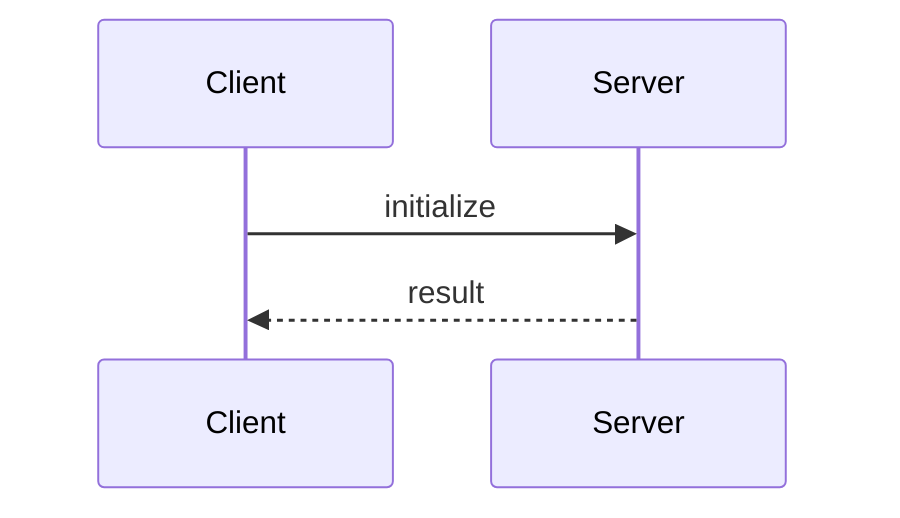

## Initialization


```mermaid
sequenceDiagram
    Client->>Server: initialize
    Server-->>Client: result
```

```json
{ "jsonrpc": "2.0", "id": 1, "method": "initialize" }
```

Continue with [messages](./index#messages).


