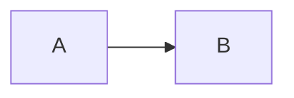

# SEP-1000: First Proposal

- **Status**: In-Review
- **Type**: Standards Track
- **Created**: 2025-01-01
- **Author(s)**: Grace (@grace)
- **PR**: https://github.com/enclawed/omcp/pull/1000

## Abstract

Builds on [SEP-999](./999-early-proposal.md#abstract) and changes the
[lifecycle](/specification/2025-01-01/basic/lifecycle#initialization).

Raw HTML is allowed in proposals
Details.

